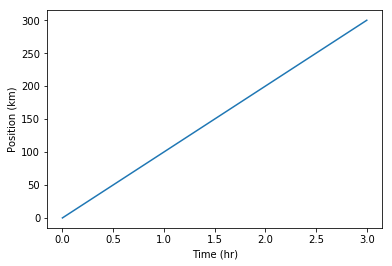
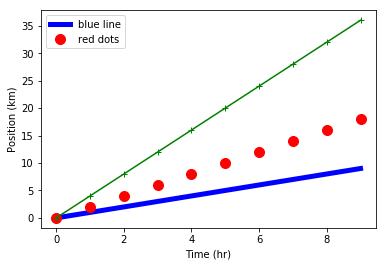
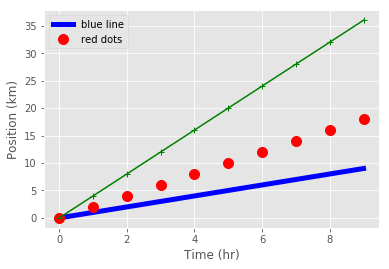
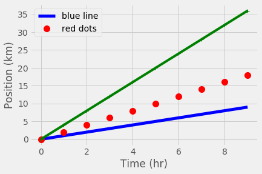
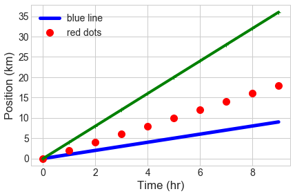
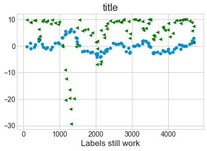
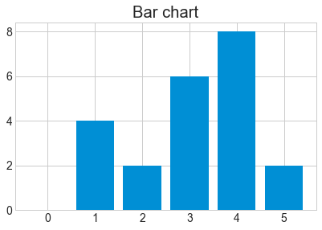
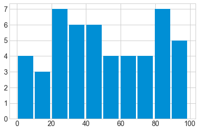
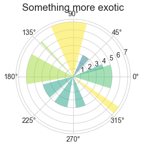
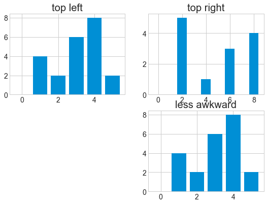

## [`matplotlib`](https://matplotlib.org/) is the most widely used scientific plotting library in Python.

*   Commonly use a sub-library called [`matplotlib.pyplot`](https://matplotlib.org/api/pyplot_api.html).
*   The Jupyter Notebook will render plots inline if we ask it to using a "magic" command.

~~~
%matplotlib inline
import matplotlib.pyplot as plt
~~~
{: .language-python}

*   Simple plots are then (fairly) simple to create.

~~~
import numpy
time = numpy.array([0,1,2,3])
position = numpy.array([0,100,200,300])

plt.plot(time, position)
plt.xlabel("Time (hr)")
plt.ylabel("Position (km)")
~~~
{: .python}

## The color and format of lines and markers can be changed.
* A shortcut for simple formatting is to use the third argument string.
* 'b-' means blue line, 'ro' means red circles, 'g+-' means green + with a line

~~~
import numpy
time = numpy.arange(10)
p1 = time
p2 = time*2
p3 = time*4

plt.plot(time, p1,'b-')
plt.plot(time, p2,'ro')
plt.plot(time, p3,'g+-')
plt.xlabel("Time (hr)")
plt.ylabel("Position (km)")
~~~
{: .python}

## More complex formatting can be achieved using the `plot` keywords 
* `linewidth` controls the thickness of the line
* `linestyle` controls the type of line
* `marker` controls the shape of the marker
* `color` controls the color of the line and marker
* `label` controls the labelling of the line for use with `plt.legend`

~~~
plt.plot(time, p1,color='blue', linestyle='-', linewidth=5,label="blue line")
plt.plot(time, p2,'ro', markersize=10, label="red dots")
plt.plot(time, p3,'g-', marker='+')
plt.xlabel("Time (hr)")
plt.ylabel("Position (km)")
plt.legend()
~~~
{: .python}

## Built in "styles" provide consistent plots
~~~
print("available style names: ", plt.style.available)
~~~
{: .python}

~~~
available style names:  ['_classic_test', 'bmh', 'classic', 'dark_background', 'fast', 'fivethirtyeight', 'ggplot', 'grayscale', 'seaborn-bright', 'seaborn-colorblind', 'seaborn-dark-palette', 'seaborn-dark', 'seaborn-darkgrid', 'seaborn-deep', 'seaborn-muted', 'seaborn-notebook', 'seaborn-paper', 'seaborn-pastel', 'seaborn-poster', 'seaborn-talk', 'seaborn-ticks', 'seaborn-white', 'seaborn-whitegrid', 'seaborn', 'Solarize_Light2', 'tableau-colorblind10']
~~~
{: .output}

~~~
plt.style.use("ggplot")
plt.plot(time, p1,color='blue', linestyle='-', linewidth=5,label="blue line")
plt.plot(time, p2,'ro', markersize=10, label="red dots")
plt.plot(time, p3,'g-', marker='+')
plt.xlabel("Time (hr)")
plt.ylabel("Position (km)")
plt.legend()
~~~
{: .python}

~~~
plt.style.use("fivethirtyeight")
plt.plot(time, p1,color='blue', linestyle='-', linewidth=5,label="blue line")
plt.plot(time, p2,'ro', markersize=10, label="red dots")
plt.plot(time, p3,'g-', marker='+')
plt.xlabel("Time (hr)")
plt.ylabel("Position (km)")
plt.legend()
~~~
{: .python}

~~~
plt.style.use("seaborn-whitegrid")
plt.plot(time, p1,color='blue', linestyle='-', linewidth=5,label="blue line")
plt.plot(time, p2,'ro', markersize=10, label="red dots")
plt.plot(time, p3,'g-', marker='+') #where's the marker?
plt.xlabel("Time (hr)")
plt.ylabel("Position (km)")
plt.legend()
~~~
{: .python}

## Plots can be scatter plots with points and no lines

~~~
numpy.random.seed(20)
x,y = numpy.random.randint(0,100,100), numpy.random.randn(100)
x=numpy.cumsum(x)
y=numpy.cumsum(y)
plt.scatter( x, y)
plt.scatter( x, 10-y**2, color='green',marker='<')
plt.xlabel("Labels still work")
plt.title("title")
~~~
{: .python}

## `matplotlib` also makes bar charts and histograms
* If you have data grouped into counts already, `bar` can make a chart
* If you have raw data, `hist` can calculate **and** plot the histogram.

~~~
x = [0,1,2,3,4,5]
y = [0,4,2,6,8,2]
plt.bar(x,y)
plt.title("Bar chart")
~~~
{: .python}

~~~
x = numpy.random.randint(0,100,50)
bin_count, bin_edges, boxes = plt.hist(x, bins=10, rwidth=0.9)
print("The counts are ", bin_count)
~~~
{: .python}
~~~
The counts are  [4. 3. 7. 6. 6. 4. 4. 4. 7. 5.]
~~~
{: .output}

~~~
# Compute pie slices
N = bin_count.size
theta = 0.5*(bin_edges[1:] + bin_edges[:-1])
theta = theta * 2*numpy.pi/theta.max()
width = numpy.pi / 4 * numpy.random.rand(N)

ax = plt.subplot(111, projection='polar')
bars = ax.bar(theta, bin_count, width=width, bottom=0.0,alpha=0.5)

# Use custom colors and opacity
for r, bar in zip(bin_count, bars):
    bar.set_facecolor(plt.cm.viridis(r / bin_count.max()))
    bar.set_alpha(0.5)

t=plt.title("Something more exotic")
~~~
{: .python}

## Define the figure size before plotting using the `figure` command
* `plt.figure` pre-defines a figure for you
* The keyword `figsize` takes two values to define the width and height

~~~
plt.figure(figsize=(8,2))
x = [0,1,2,3,4,5]
y = [0,4,2,6,8,2]
plt.bar(x,y)
plt.title("narrow bar chart")
~~~
{: .python}

## Place multiple figures on one plot with `subplot`
* `plt.subplot` takes three arguments : (number_of_rows, number_of_columns, location)

~~~
plt.figure(figsize=(8,2))
x = [0,1,2,3,4,5]
y = [0,4,2,6,8,2]
plt.subplot(2,2,1)
plt.bar(x,y)
plt.title("top left")
plt.subplot(2,2,2)
plt.bar(y,x)
plt.title("top right")
plt.subplot(2,2,4)
plt.bar(x,y)
plt.title("sometimes the formatting is awkward")
~~~
{: .python}

It's easy to put too much data into a figure and make it unreadable! Make sure there is enough space to see all of the elements in the plot.

~~~
plt.figure(figsize=(8,6))
x = [0,1,2,3,4,5]
y = [0,4,2,6,8,2]
plt.subplot(2,2,1)
plt.bar(x,y)
plt.title("top left")
plt.subplot(2,2,2)
plt.bar(y,x)
plt.title("top right")
plt.subplot(2,2,4)
plt.bar(x,y)
plt.title("less awkward")
~~~
{: .python}

## Saving your plot to a file
* After plotting, use [`plt.savefig`](https://matplotlib.org/api/_as_gen/matplotlib.pyplot.savefig.html) to save the figure to a file
* The figure size you specified is (approximately) the size in inches.
* For PNG/JPG images you can specify the resolution with `dpi`

~~~
plt.figure(figsize=(8,3))
plt.plot(x,y)
plt.savefig("data/fig1.pdf") #PDF format
plt.savefig("data/fig1.png", dpi=150, transparent=True) #PNG format
~~~
{: .python}

> Note that functions in `plt` refer to a global figure variable
> and after a figure has been displayed to the screen (e.g. with `plt.show`) 
> matplotlib will make this  variable refer to a new empty figure.
> Therefore, make sure you call `plt.savefig` before the plot is displayed to
> the screen, otherwise you may find a file with an empty plot.
>
> It is also possibile to save the figure to file by first getting a reference to the 
> figure with `plt.gcf`, then calling the `savefig` class method from that variable.
>
> ~~~
> fig = plt.gcf() # get current figure
> data.plot(kind='bar')
> fig.savefig('my_figure.png')
> ~~~
> {: .language-python}
{: .callout}

